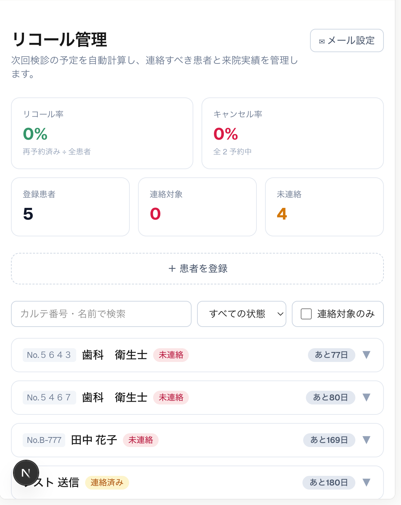

# 歯科リコール管理システム

歯科クリニックの**定期検診の再来院（リコール）管理**を効率化する Web アプリです。
「電話が中心で連絡漏れが起きる」「次回検診の対象を紙・Excel から抽出するのが手間」という課題を、
**次回検診日の自動計算・連絡対象の一覧化・ワンクリックのリコールメール送信**で解決します。

- **誰のため**：歯科クリニックの受付・歯科衛生士（業務向け）
- **何を解決**：定期検診のリコール漏れをなくし、再来院率（＝医院の安定収益）を高める

🔗 **公開URL**：https://nextjs-todo-app-ueno-projects1.vercel.app/recall
💻 **GitHub**：https://github.com/ueno-amika/nextjs-todo-app

## スクリーンショット



## 主な機能

- **次回検診日の自動計算**：前回来院日＋推奨間隔から算出し、「あと◯日／◯日超過」を表示
- **連絡対象の抽出**：期限が近い/過ぎた未連絡の患者を一覧化。ステータス（未連絡/連絡済み/再予約済み）管理
- **指標の可視化**：医院全体のリコール率・キャンセル率／患者ごとのリコール率・キャンセル率・遅刻率（平均遅刻時間）
- **検索**：カルテ番号・名前で検索。クリックで患者カードを展開
- **予約履歴**：来院/キャンセル/無断キャンセル、治療内容、遅刻分を記録・表示
- **リコールメール送信**：Resend 連携。テンプレート（差し込みタグ対応）から件名・本文を生成し、送信すると連絡履歴に自動記録

## 技術スタック

| 分類           | 使用技術                                              |
| -------------- | ----------------------------------------------------- |
| フレームワーク | Next.js 16（App Router / Turbopack）                  |
| 言語・UI       | TypeScript / React 19 / Tailwind CSS v4               |
| メール送信     | Resend（サーバー側 Route Handler 経由）               |
| データ保持     | localStorage（`useSyncExternalStore` で外部ストア化） |
| ホスティング   | Vercel（GitHub 連携で自動デプロイ）                   |

> 秘密キー（Resend / OpenWeatherMap）はサーバー側の Route Handler（`/api/*`）でのみ使用し、ブラウザには渡していません。

## セットアップ

1. `.env.example` を参考に `.env.local` を作成し、キーを設定します。

   ```bash
   # リコールメール送信（https://resend.com）
   RESEND_API_KEY=あなたのResendキー
   RESEND_FROM=onboarding@resend.dev   # 認証済み独自ドメインがあればそのアドレス
   # 天気アプリを使う場合（https://openweathermap.org/api）
   OPENWEATHER_API_KEY=あなたのAPIキー
   ```

2. 依存をインストールして開発サーバーを起動します。

   ```bash
   npm install
   npm run dev
   ```

   [http://localhost:3000/recall](http://localhost:3000/recall) を開きます。

> メールの本番送信（任意の宛先へ）には Resend で独自ドメインの認証が必要です。
> 未認証（`onboarding@resend.dev`）の場合は自分のアドレス宛てにのみ送信できます。

## 収録アプリ

このリポジトリには学習の過程で作った複数のアプリが含まれます。

| アプリ           | ルート    | 概要                                          |
| ---------------- | --------- | --------------------------------------------- |
| 歯科リコール管理 | `/recall` | 本README のメイン                             |
| 天気予報         | `/`       | 都市/現在地の天気・週間予報（OpenWeatherMap） |
| ToDo             | `/todo`   | タスク管理（localStorage）                    |

## ディレクトリ構成（主要）

```
src/
  app/
    recall/page.tsx            リコール管理ページ
    api/recall-email/route.ts  Resend でメール送信（サーバー側）
    api/weather/route.ts       OpenWeatherMap（サーバー側）
    layout.tsx                 共通レイアウト（ナビ）
  components/
    recall-app.tsx             リコール管理の画面
  lib/
    recall-store.ts            患者・予約・指標のロジック（localStorage）
    recall-settings.ts         メールテンプレート設定
requirements-recall.md         リコール管理の要件定義書
```

## デプロイ（Vercel）

GitHub の `main` へ push すると Vercel が自動デプロイします。
Vercel 側でも環境変数（`RESEND_API_KEY` / `RESEND_FROM` / `OPENWEATHER_API_KEY`）を
Project → Settings → Environment Variables に設定してください。
