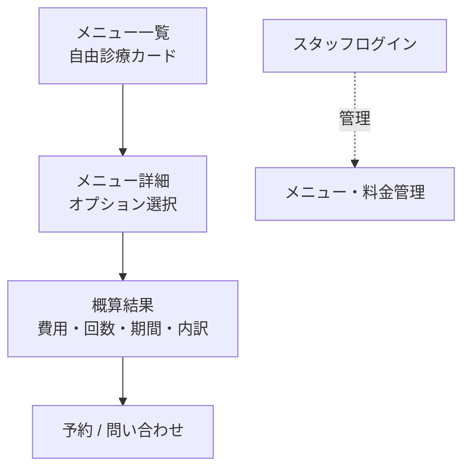

# 要件定義書：歯科 診療メニュー・料金シミュレーター「Dental Estimate（仮）」

| 項目         | 内容                                                 |
| ------------ | ---------------------------------------------------- |
| プロダクト名 | Dental Estimate（仮）                                |
| 版数         | v1.0                                                 |
| 作成日       | 2026-08-12                                           |
| 技術スタック | Next.js + Supabase + Vercel                          |
| 想定ユーザー | 見込み患者（B2C・集患向け） / メニュー管理はスタッフ |

> **実装者向けメモ**：本プロジェクトの Next.js は独自版のため、コードを書く前に必ず `AGENTS.md` と `node_modules/next/dist/docs/` の該当ガイドを読むこと。

---

## 1. プロジェクト概要

### 背景 — なぜこのシステムを作るのか

歯科の自由診療（ホワイトニング・矯正・インプラント等）は、

- 費用が保険外で高額なうえ、**Webサイトに「◯円〜」としか書かれておらず総額が分からない**
- 「いくらかかるか不安」で問い合わせ前に離脱してしまう見込み患者が多い
- 電話で費用だけ聞くのは心理的ハードルが高い

そこで、**希望する治療とオプションを選ぶだけで概算費用・回数・期間が分かる**シミュレーターを提供し、見込み患者の不安を減らして問い合わせ・来院につなげる。

### 目的 — どんな状態を実現したいか

- 見込み患者が**数タップで自分のケースの概算費用を把握**できる状態
- 費用への不安が下がり、**そのまま予約・問い合わせに進む**動線がある状態
- クリニックが**メニューと料金を自分で更新**できる状態

### スコープ

**含むもの（In Scope）**

- 診療メニュー（自由診療）の一覧・選択
- オプション選択による概算費用・回数・期間の算出
- 概算結果の表示（内訳つき）
- 予約・問い合わせへの導線
- スタッフによるメニュー・料金の管理（登録・編集）

**含まないもの（Out of Scope / 将来検討）**

- 保険診療の点数計算（あくまで自由診療の概算）
- 正式な見積書の発行・法的効力
- オンライン決済
- 個別の口腔状態に基づく精密見積り（「概算」である旨を明記）

---

## 2. ユーザーストーリー

想定ユーザー種別：**見込み患者** / **クリニックスタッフ（メニュー管理）**

```
As a 見込み患者,
I want 受けたい治療（ホワイトニング等）を選べること,
So that 自分が知りたい費用にすぐ辿り着ける.

As a 見込み患者,
I want 本数・範囲などのオプションを選ぶと概算費用が変わること,
So that 自分のケースに近い金額を把握できる.

As a 見込み患者,
I want 概算の回数・期間も一緒に見られること,
So that 費用だけでなく通院の負担も判断できる.

As a 見込み患者,
I want 結果画面からそのまま予約・問い合わせできること,
So that 不安が解消したタイミングで行動に移せる.

As a スタッフ,
I want メニューと料金を自分で登録・編集できること,
So that 価格改定にすぐ対応できる.
```

---

## 3. 機能要件

| ID   | 機能名                   | 説明                                  | 優先度 | Phase  |
| ---- | ------------------------ | ------------------------------------- | ------ | ------ |
| F-01 | メニュー一覧表示         | 自由診療メニューをカードで一覧表示    | 高     | MVP    |
| F-02 | メニュー選択             | 治療を1つ選択し詳細・オプションへ     | 高     | MVP    |
| F-03 | オプション選択           | 本数・範囲・素材等を選択（単一/複数） | 高     | MVP    |
| F-04 | 概算費用の算出           | 選択内容から概算費用を計算・表示      | 高     | MVP    |
| F-05 | 回数・期間の表示         | 概算の通院回数・治療期間を表示        | 高     | MVP    |
| F-06 | 費用内訳の表示           | 基本料金＋オプションの内訳を提示      | 中     | MVP    |
| F-07 | 注意書き表示             | 「概算であり確定額ではない」旨を明記  | 高     | MVP    |
| F-08 | 予約・問い合わせ導線     | 結果画面から予約/問い合わせへ遷移     | 中     | MVP    |
| F-09 | メニュー管理（スタッフ） | メニュー・オプション・料金の登録/編集 | 中     | Phase2 |
| F-10 | 結果の共有               | 概算結果をURL/画像で共有・保存        | 低     | Phase3 |

---

## 4. 非機能要件

| 分類             | 要件                                                                                                          |
| ---------------- | ------------------------------------------------------------------------------------------------------------- |
| パフォーマンス   | ページ読み込み3秒以内。選択操作に対し費用は即時（1秒以内）再計算                                              |
| セキュリティ     | 患者側は個人情報を入力しない設計（概算のみ）。メニュー管理はスタッフのみ（Supabase Auth + RLS）。通信は HTTPS |
| 可用性           | SLA 99%（Vercel / Supabase 無料枠に準拠）                                                                     |
| スケーラビリティ | 同時接続100ユーザーを想定。Supabase 無料枠内で運用                                                            |
| ユーザビリティ   | スマホ優先。3〜4タップで概算に到達。金額は大きく分かりやすく                                                  |
| 信頼性（表記）   | 「概算であり実際の費用は診察により変動する」旨を必ず明示（誤認防止）                                          |
| 保守性           | 料金はコード直書きせずDBのマスタで管理し、非エンジニアでも更新可能に                                          |

---

## 5. 制約条件

- **予算**：無料枠で完結（Vercel Hobby / Supabase Free）
- **期間**：2週間（MVP：F-01〜F-08 を優先）
- **技術**：Next.js + Supabase + Vercel
- **その他**：
  - 表示金額はあくまで概算。医療広告ガイドラインに配慮した表記にする
  - MVP はメニュー/料金を Supabase のマスタで保持（管理UIは Phase2）

---

## 6. 画面遷移（サイトマップ）



**画面一覧**

| 画面                          | 対象       | 主な機能                     |
| ----------------------------- | ---------- | ---------------------------- |
| メニュー一覧                  | 見込み患者 | F-01                         |
| メニュー詳細 / オプション選択 | 見込み患者 | F-02, F-03                   |
| 概算結果                      | 見込み患者 | F-04, F-05, F-06, F-07, F-08 |
| スタッフログイン              | スタッフ   | 認証                         |
| メニュー・料金管理            | スタッフ   | F-09                         |

---

## 7. 参考デザイン

- 参考：保険・引越し等の「料金シミュレーター」、ECの商品オプション選択UI
- 対象メニュー例（マスタ初期値）：
  - **ホワイトニング**：オフィス／ホーム／デュアル、回数オプション
  - **矯正**：ワイヤー／マウスピース、部分／全体
  - **インプラント**：本数、被せ物の素材
  - **セラミック（詰め物・被せ物）**：素材（ジルコニア/e-max等）、本数
- デザイン方針：
  - スマホファースト、金額は大きく即時更新でインタラクティブに
  - 内訳は折りたたみで「詳しく見る」
  - 結果画面の下部に予約/問い合わせCTAを常設

---

## 8. データモデル

**スキーマ定義（Supabase / PostgreSQL）**

```
-- 治療メニュー（自由診療）
menus (
  id            uuid PK default gen_random_uuid(),
  name          text not null,      -- 例：ホワイトニング
  description   text,
  base_price    int  not null,      -- 基本料金
  base_visits   int  default 1,     -- 基本の通院回数
  duration_note text,               -- 期間の目安（例：1〜2ヶ月）
  sort_order    int  default 0,
  is_active     boolean default true
)

-- メニューのオプション
menu_options (
  id           uuid PK default gen_random_uuid(),
  menu_id      uuid references menus(id) on delete cascade,
  label        text not null,       -- 例：本数、素材、範囲
  option_type  text default 'single', -- 'single'|'multiple'|'quantity'
  price_delta  int  default 0,      -- 加算額（quantity の場合は単価）
  visits_delta int  default 0,      -- 回数への影響
  sort_order   int  default 0
)

-- スタッフ（メニュー管理用・auth.users と 1:1）
staff (
  id    uuid PK references auth.users(id),
  name  text,
  role  text default 'staff'
)
```

- 概算費用 = `base_price + Σ(選択オプションの price_delta × 数量)`
- 概算回数 = `base_visits + Σ(選択オプションの visits_delta)`
- **RLS**：`menus` / `menu_options` は全ユーザー SELECT 可、INSERT/UPDATE は staff のみ。

---

## 9. 実装の進め方（MVP → 拡張）

1. **DBスキーマ構築**：§8 のテーブル＋RLS＋メニュー初期データを Supabase マイグレーションで作成
2. **メニュー一覧・詳細**：マスタからカード表示→オプション選択（F-01/F-02/F-03）
3. **概算ロジック**：選択に応じて費用・回数・期間を即時計算（F-04/F-05/F-06）
4. **注意書き＋CTA**：概算である旨の明記と予約/問い合わせ導線（F-07/F-08）
5. **Phase2以降**：メニュー管理UI(F-09)・結果共有(F-10)

> 実装着手前に必ず `AGENTS.md` と `node_modules/next/dist/docs/` を確認すること。
