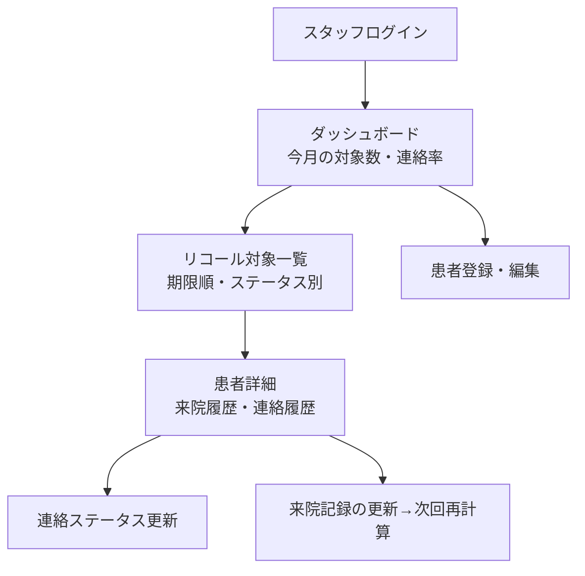

# 要件定義書：歯科リコール（再来院）管理システム「Recall（仮）」

| 項目         | 内容                                |
| ------------ | ----------------------------------- |
| プロダクト名 | Recall（仮）                        |
| 版数         | v1.0                                |
| 作成日       | 2026-08-12                          |
| 技術スタック | Next.js + Supabase + Vercel         |
| 想定ユーザー | クリニックスタッフ（B2B・業務向け） |

> **実装者向けメモ**：本プロジェクトの Next.js は独自版のため、コードを書く前に必ず `AGENTS.md` と `node_modules/next/dist/docs/` の該当ガイドを読むこと。

---

## 1. プロジェクト概要

### 背景 — なぜこのシステムを作るのか

歯科医院の経営で最も重要な指標のひとつが「リコール率（定期検診の再来院率）」。しかし多くの医院では、

- 次回検診の管理が紙カルテ・Excel依存で、対象者の抽出に手間がかかる
- 「そろそろ検診」の連絡が属人的で、漏れが発生する
- 一度離れた患者を放置してしまい、再来院につながらない（＝売上の機会損失）

そこで、**患者ごとの次回検診予定を自動で管理し、対象者を一覧化して連絡漏れをなくす**システムを構築し、リコール率と医院の安定収益を高める。

### 目的 — どんな状態を実現したいか

- スタッフが**「今月連絡すべき患者」をワンクリックで一覧**できる状態
- 連絡状況（未連絡／連絡済み／再予約済み）を**チームで共有・管理**できる状態
- 検診間隔に応じて**次回予定日が自動計算**され、抽出作業がゼロになる状態

### スコープ

**含むもの（In Scope）**

- 患者情報とリコール設定（前回来院日・推奨間隔）の登録
- 次回検診予定日の自動計算
- 連絡対象者（期限が近い／過ぎた患者）の一覧抽出
- 連絡ステータスの記録（未連絡／連絡済み／再予約済み）
- 連絡履歴の記録
- メールによるリコール通知

**含まないもの（Out of Scope / 将来検討）**

- 電子カルテ・レセプト連携
- 予約枠の管理・オンライン予約（別システム「Dental Reserve」と連携想定）
- SMS / LINE / 自動電話
- 保険点数・会計

---

## 2. ユーザーストーリー

想定ユーザー種別：**クリニックスタッフ（受付・歯科衛生士）**

```
As a スタッフ,
I want 患者の前回来院日と推奨検診間隔を登録できること,
So that 次回検診予定日を自動で管理できる.

As a スタッフ,
I want 「今月連絡すべき患者」を一覧で抽出できること,
So that リコール連絡の漏れをなくせる.

As a スタッフ,
I want 各患者の連絡ステータスを更新できること,
So that 誰に連絡済みかをチームで共有できる.

As a スタッフ,
I want リコール対象者へメールで案内を送れること,
So that 連絡の手間を減らせる.

As a スタッフ,
I want 患者ごとの連絡履歴を確認できること,
So that 何度も同じ連絡をしてしまうのを防げる.
```

---

## 3. 機能要件

| ID   | 機能名               | 説明                                     | 優先度 | Phase  |
| ---- | -------------------- | ---------------------------------------- | ------ | ------ |
| F-01 | スタッフログイン     | Email + Google OAuth で認証              | 高     | MVP    |
| F-02 | 患者登録             | 氏名・連絡先・前回来院日・推奨間隔を登録 | 高     | MVP    |
| F-03 | 次回予定日の自動計算 | 前回来院日＋推奨間隔で次回検診日を算出   | 高     | MVP    |
| F-04 | リコール対象一覧     | 期限が近い／過ぎた患者を抽出・表示       | 高     | MVP    |
| F-05 | 連絡ステータス管理   | 未連絡／連絡済み／再予約済み を更新      | 高     | MVP    |
| F-06 | 連絡履歴の記録       | いつ・誰が・どの方法で連絡したかを記録   | 高     | MVP    |
| F-07 | 患者検索・絞り込み   | 氏名・ステータス・期限で絞り込み         | 中     | MVP    |
| F-08 | メール通知           | 対象患者へリコール案内メールを送信       | 中     | Phase2 |
| F-09 | 来院記録の更新       | 来院時に前回来院日を更新→次回を再計算    | 中     | Phase2 |
| F-10 | ダッシュボード       | 今月の対象数・連絡率・再来院率を表示     | 低     | Phase3 |
| F-11 | 予約システム連携     | 「Dental Reserve」の予約実績を取り込む   | 低     | Phase3 |

---

## 4. 非機能要件

| 分類             | 要件                                                                                                                                  |
| ---------------- | ------------------------------------------------------------------------------------------------------------------------------------- |
| パフォーマンス   | 対象一覧は患者1,000件でも1秒以内に抽出・表示                                                                                          |
| セキュリティ     | Supabase Auth（Email + Google OAuth）。**患者の連絡先を扱うため、RLS でスタッフ（認証済み・role=staff）のみアクセス可**。通信は HTTPS |
| 可用性           | SLA 99%（Vercel / Supabase 無料枠に準拠）                                                                                             |
| スケーラビリティ | 患者数1,000〜3,000件を想定。Supabase 無料枠内で運用                                                                                   |
| ユーザビリティ   | 一覧→ステータス更新を最小クリックで。忙しい受付業務でも使える導線                                                                     |
| プライバシー     | 個人情報の取扱い方針を明記。退会・削除依頼に対応                                                                                      |
| 保守性           | TypeScript。Supabase マイグレーションでスキーマ管理                                                                                   |

---

## 5. 制約条件

- **予算**：無料枠で完結（Vercel Hobby / Supabase Free）
- **期間**：2週間（MVP：F-01〜F-07 を優先）
- **技術**：Next.js + Supabase + Vercel
- **その他**：Supabase 無料枠の制限を前提。メール送信は無料枠のサービスを利用

---

## 6. 画面遷移（サイトマップ）



**画面一覧**

| 画面             | 対象     | 主な機能         |
| ---------------- | -------- | ---------------- |
| ログイン         | スタッフ | F-01             |
| ダッシュボード   | スタッフ | F-10             |
| リコール対象一覧 | スタッフ | F-04, F-05, F-07 |
| 患者詳細         | スタッフ | F-06, F-09       |
| 患者登録・編集   | スタッフ | F-02, F-03       |

---

## 7. 参考デザイン

- 参考：CRM / 顧客管理ツールの「フォローアップ一覧」UI
- デザイン方針：
  - 一覧はステータスを色バッジで表示（未連絡＝赤 / 連絡済み＝黄 / 再予約済み＝緑）
  - 期限超過は目立たせる（背景色 or アイコン）
  - PC業務前提だがタブレットでも操作可能なレイアウト

---

## 8. データモデル

**スキーマ定義（Supabase / PostgreSQL）**

```
-- スタッフ（auth.users と 1:1）
staff (
  id         uuid PK references auth.users(id),
  name       text not null,
  role       text default 'staff',
  created_at timestamptz default now()
)

-- 患者
patients (
  id                uuid PK default gen_random_uuid(),
  name              text not null,
  phone             text,
  email             text,
  last_visit_at     date,               -- 前回来院日
  recall_interval_m int  default 6,     -- 推奨検診間隔（月）
  next_due_at       date,               -- 次回検診予定日（自動計算）
  status            text default 'pending', -- 'pending'|'contacted'|'rebooked'
  created_at        timestamptz default now()
)

-- 連絡履歴
recall_logs (
  id           uuid PK default gen_random_uuid(),
  patient_id   uuid references patients(id) on delete cascade,
  staff_id     uuid references staff(id),
  method       text,   -- 'email'|'phone'|'postcard'
  note         text,
  contacted_at timestamptz default now()
)
```

- `next_due_at = last_visit_at + recall_interval_m ヶ月`（登録・来院更新時に算出）
- リコール対象抽出：`next_due_at <= 今日 + N日` かつ `status = 'pending'`
- **RLS**：`patients` / `recall_logs` / `staff` は認証済み staff のみ全操作可。

---

## 9. 実装の進め方（MVP → 拡張）

1. **DBスキーマ構築**：§8 のテーブル＋RLS を Supabase マイグレーションで作成
2. **認証**：Supabase Auth（Email + Google OAuth）＋ staff レコード作成（F-01）
3. **患者登録・次回計算**：登録フォーム＋ `next_due_at` 自動計算（F-02/F-03）
4. **リコール対象一覧**：期限・ステータスで抽出、絞り込み（F-04/F-07）
5. **ステータス更新・連絡履歴**：一覧/詳細から更新（F-05/F-06）
6. **Phase2以降**：メール通知(F-08)・来院更新(F-09)・ダッシュボード(F-10)・予約連携(F-11)

> 実装着手前に必ず `AGENTS.md` と `node_modules/next/dist/docs/` を確認すること。
