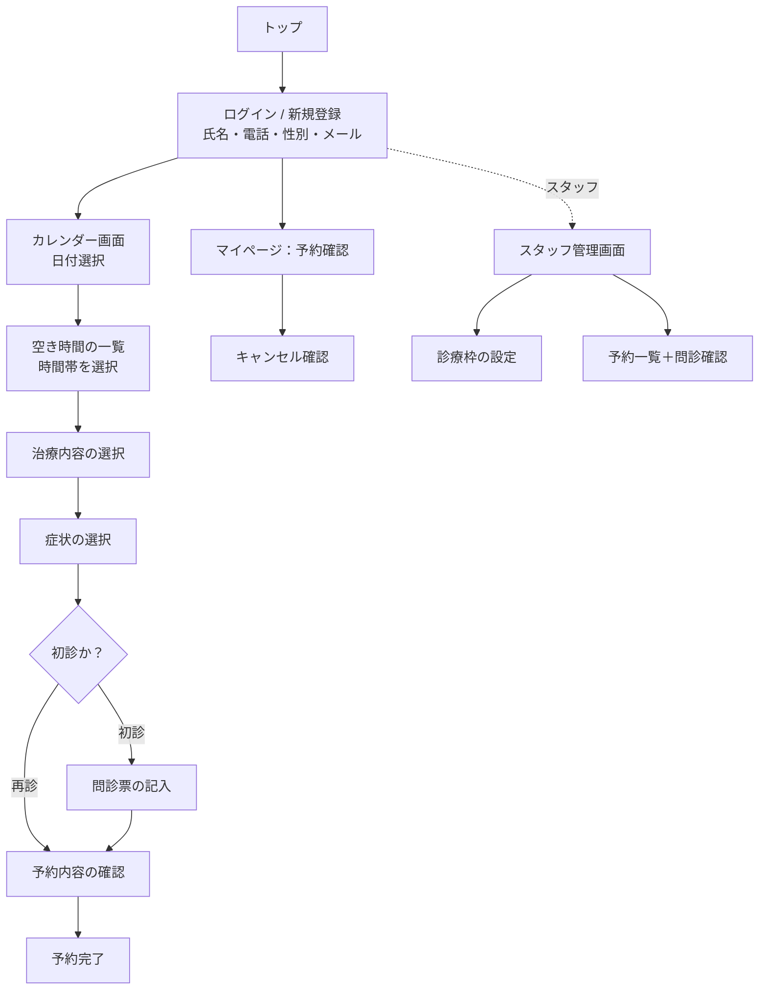

# 要件定義書：歯科クリニック予約サイト「Dental Reserve（仮）」

| 項目         | 内容                               |
| ------------ | ---------------------------------- |
| プロダクト名 | Dental Reserve（仮）               |
| 版数         | v1.0                               |
| 作成日       | 2026-08-12                         |
| 技術スタック | Next.js + Supabase + Vercel        |
| 参考イメージ | アポツール（歯科予約管理システム） |

> **実装者向けメモ**：本プロジェクトの Next.js は独自版のため、コードを書く前に必ず `AGENTS.md` と `node_modules/next/dist/docs/` の該当ガイドを読むこと。

---

## 1. プロジェクト概要

### 背景 — なぜこのシステムを作るのか

歯科クリニックの予約は電話受付が中心で、以下の課題がある。

- 診療中は電話に出られず患者を取りこぼす（機会損失）
- 空き時間が患者側から分からず、電話での日程調整に手間がかかる
- 初診の問診を来院後に紙で記入するため、待ち時間が長く受付が混雑する
- 予約台帳が紙・Excelだと、ダブルブッキングや記入漏れが起きやすい

そこで、**患者が24時間Webから空き時間を見て予約でき、初診の問診票も事前記入できる**予約サイトを構築し、受付業務の負担と待ち時間を削減する。

### 目的 — どんな状態を実現したいか

- 患者が**カレンダーで空き時間を確認し、治療内容まで選んで予約完了**できる状態
- 初診患者が**来院前に問診票を記入**でき、来院後すぐ診療に入れる状態
- クリニック側が**予約状況を一元管理**し、ダブルブッキングを防げる状態

### スコープ

**含むもの（In Scope）**

- 患者情報の登録・ログイン（氏名・電話番号・性別・メール）
- カレンダー形式での空き時間表示・予約
- 治療内容・症状の選択
- 初診患者向けの問診票（事前記入）
- 予約の確認・キャンセル
- クリニック側の予約枠設定・予約一覧管理

**含まないもの（Out of Scope / 将来検討）**

- オンライン決済・保険点数計算
- 電子カルテ・レセプト・会計システム連携
- SMS / LINE 通知（初期はメールのみ）
- ネイティブアプリ（iOS / Android）
- 複数医院の統合管理

---

## 2. ユーザーストーリー

想定ユーザー種別：**患者** / **クリニックスタッフ（受付・歯科医）**

```
As a 患者,
I want 氏名・電話番号・性別・メールを登録してログインできること,
So that 毎回情報を入力せずスムーズに予約できる.

As a 患者,
I want カレンダーで日付を選び、空いている時間を一覧で見られること,
So that 電話をかけずに都合の良い枠を自分で選べる.

As a 患者,
I want 時間を選んだ後に治療内容と症状を選べること,
So that クリニックが事前に準備でき、当日の診療がスムーズになる.

As a 初診の患者,
I want 来院前に問診票を記入できること,
So that 受付での待ち時間を減らし、すぐ診療に入れる.

As a 患者,
I want 自分の予約を確認・キャンセルできること,
So that 予定変更に自分で対応できる.

As a クリニックスタッフ,
I want 予約可能な診療枠を設定できること,
So that 診療時間・休診日に合わせて受付を制御できる.

As a クリニックスタッフ,
I want 予約と問診内容を一覧で確認できること,
So that 当日の診療準備を効率よく行える.

As a クリニックスタッフ,
I want 同じ枠に二重予約が入らないこと,
So that ダブルブッキングによる診療トラブルを防げる.
```

---

## 3. 機能要件

| ID   | 機能名                 | 説明                                                                         | 優先度 | Phase  |
| ---- | ---------------------- | ---------------------------------------------------------------------------- | ------ | ------ |
| F-01 | 患者登録・ログイン     | 氏名・電話番号・性別・メールを入力して登録／ログイン（Email + Google OAuth） | 高     | MVP    |
| F-02 | カレンダー表示         | 月/週カレンダーで日付を選択、空き有無を表示                                  | 高     | MVP    |
| F-03 | 空き時間の表示         | 選択日の診療枠を時間帯ごとに一覧表示（空き/満）                              | 高     | MVP    |
| F-04 | 治療内容の選択         | マスタから治療内容を1つ選択                                                  | 高     | MVP    |
| F-05 | 症状の選択             | 症状を複数選択（任意）                                                       | 高     | MVP    |
| F-06 | 予約の確定             | 日時＋治療＋症状で予約を確定                                                 | 高     | MVP    |
| F-07 | ダブルブッキング防止   | 予約済み枠をDB制約で拒否                                                     | 高     | MVP    |
| F-08 | 問診票（初診）         | 初診患者が来院前に問診票を記入・保存                                         | 高     | MVP    |
| F-09 | 予約の確認・キャンセル | 患者が自分の予約を確認・キャンセルし枠を開放                                 | 高     | MVP    |
| F-10 | 診療枠の設定           | スタッフが診療日時・受付可能枠を登録                                         | 高     | MVP    |
| F-11 | 予約一覧（スタッフ）   | スタッフが全予約＋問診内容を一覧・確認                                       | 高     | MVP    |
| F-12 | メール通知             | 予約確定・キャンセル時に控えを送信                                           | 中     | Phase2 |
| F-13 | 診療枠の一括登録       | 曜日・時間帯を指定して繰り返し枠を生成                                       | 中     | Phase2 |
| F-14 | 予約リマインダー       | 予約前日に自動でメール送信                                                   | 低     | Phase3 |
| F-15 | 診療履歴の表示         | 患者が過去の来院・治療履歴を閲覧                                             | 低     | Phase3 |

### 選択肢マスタ（実装用の初期値）

**治療内容（treatments）**

- 定期検診
- クリーニング（歯石除去）
- 虫歯治療
- 歯周病治療
- 詰め物・被せ物
- 親知らず相談
- ホワイトニング
- その他

**症状（symptoms／複数選択可）**

- 痛みがある
- しみる
- 腫れている
- 出血がある
- 詰め物・被せ物が取れた
- 歯が欠けた・折れた
- 口臭が気になる
- 特になし（検診希望）

**問診票の項目（questionnaires／初診時）**

- 現在治療中の病気の有無（内容）
- 服用中の薬の有無（内容）
- アレルギーの有無（薬・金属・その他）
- 過去の歯科治療での麻酔トラブルの有無
- 妊娠の有無・可能性
- 喫煙習慣の有無
- 最後に歯科を受診した時期
- 主訴（今回来院した一番の理由・自由記述）

---

## 4. 非機能要件

| 分類             | 要件                                                                                                                                                                                                            |
| ---------------- | --------------------------------------------------------------------------------------------------------------------------------------------------------------------------------------------------------------- |
| パフォーマンス   | 主要ページの読み込みを3秒以内（LCP 2.5秒目標）。カレンダー・空き枠表示は1秒以内に描画                                                                                                                           |
| セキュリティ     | 認証は Email + Google OAuth（Supabase Auth）。**問診票・電話番号・性別など個人情報／要配慮情報を扱うため、Supabase RLS で「患者は自分のデータのみ操作可」「スタッフのみ全予約閲覧可」を強制**。通信は全て HTTPS |
| 可用性           | SLA 99%（Vercel / Supabase の無料枠SLAに準拠）。計画メンテは事前告知                                                                                                                                            |
| スケーラビリティ | 同時接続100ユーザーを想定。Supabase 無料枠内で運用                                                                                                                                                              |
| データ整合性     | 診療枠の定員に対する予約数を DB 制約・トランザクションで保証しダブルブッキングを排除                                                                                                                            |
| ユーザビリティ   | スマホ優先（レスポンシブ）。カレンダー→時間→治療→症状を数タップで完了。高齢患者も想定し文字大きめ・導線シンプルに                                                                                               |
| プライバシー     | 問診票データの取扱い方針を明記。退会時のデータ削除に対応                                                                                                                                                        |
| 保守性           | TypeScript による型安全。Supabase マイグレーションでスキーマをバージョン管理                                                                                                                                    |

---

## 5. 制約条件

- **予算**：無料枠で完結（Vercel Hobby / Supabase Free / 独自ドメインは任意）
- **期間**：2週間（MVP：F-01〜F-11 を優先実装）
- **技術**：Next.js + Supabase + Vercel
- **その他**：
  - Supabase 無料枠の制限（DB 500MB、非アクティブ7日で一時停止）を前提
  - メール送信は Supabase 標準機能または無料枠のメールサービスを利用
  - 個人情報・要配慮情報を扱うため、本番運用時はプライバシーポリシーの整備が必要

---

## 6. 画面遷移（サイトマップ）



**画面一覧**

| 画面                  | 対象     | 主な機能                         |
| --------------------- | -------- | -------------------------------- |
| トップ                | 全員     | クリニック紹介・ログイン導線     |
| ログイン / 登録       | 患者     | F-01（氏名・電話・性別・メール） |
| カレンダー画面        | 患者     | F-02                             |
| 空き時間の一覧        | 患者     | F-03                             |
| 治療内容の選択        | 患者     | F-04                             |
| 症状の選択            | 患者     | F-05                             |
| 問診票の記入          | 初診患者 | F-08                             |
| 予約内容の確認 / 完了 | 患者     | F-06, F-07                       |
| マイページ            | 患者     | F-09                             |
| スタッフ管理画面      | スタッフ | F-10, F-11                       |

---

## 7. 参考デザイン

- **参考イメージ：アポツール**（歯科向け予約管理システム）
- 参考にする点：
  - カレンダー＋時間枠を一目で把握できるレイアウト
  - 治療内容・症状をタップで選ぶシンプルな入力フロー
  - 初診／再診で問診票の要否を出し分け
- デザイン方針：
  - スマホファースト、余白広め・文字大きめ（幅広い年齢層に配慮）
  - 空き枠＝アクティブ色 / 予約済み＝グレーアウトで判別
  - 予約完了は控え（日時・治療内容）を分かりやすく表示

---

## 8. データモデル

```
patients          … 患者（Supabase Auth と 1:1）
slots             … 診療枠
reservations      … 予約
reservation_symptoms … 予約と症状の中間テーブル（多対多）
questionnaires    … 問診票（初診時）
treatments        … 治療内容マスタ
symptoms          … 症状マスタ
```

**スキーマ定義（Supabase / PostgreSQL）**

```
-- 患者（auth.users と 1:1）
patients (
  id            uuid PK  references auth.users(id),
  name          text     not null,
  phone         text     not null,
  gender        text     not null,   -- 'male' | 'female' | 'other'
  email         text     not null,
  is_first_visit boolean default true,
  role          text     default 'patient',  -- 'patient' | 'staff'
  created_at    timestamptz default now()
)

-- 治療内容マスタ
treatments (
  id    serial PK,
  name  text not null
)

-- 症状マスタ
symptoms (
  id    serial PK,
  name  text not null
)

-- 診療枠
slots (
  id           uuid PK default gen_random_uuid(),
  start_at     timestamptz not null,
  end_at       timestamptz not null,
  capacity     int  default 1,
  is_available boolean default true,
  created_at   timestamptz default now()
)

-- 予約
reservations (
  id            uuid PK default gen_random_uuid(),
  slot_id       uuid references slots(id) not null,
  patient_id    uuid references patients(id) not null,
  treatment_id  int  references treatments(id) not null,
  status        text default 'confirmed',  -- 'confirmed' | 'cancelled'
  created_at    timestamptz default now(),
  UNIQUE(slot_id)  -- capacity=1 前提でダブルブッキング防止
)

-- 予約×症状（多対多）
reservation_symptoms (
  reservation_id uuid references reservations(id) on delete cascade,
  symptom_id     int  references symptoms(id),
  PRIMARY KEY (reservation_id, symptom_id)
)

-- 問診票（初診）
questionnaires (
  id          uuid PK default gen_random_uuid(),
  patient_id  uuid references patients(id) not null,
  answers     jsonb not null,   -- 上記「問診票の項目」を保存
  created_at  timestamptz default now()
)
```

**RLS 方針**

- `patients` / `reservations` / `reservation_symptoms` / `questionnaires`：本人（`auth.uid()` が一致）のみ SELECT/INSERT/UPDATE。`role='staff'` は全件 SELECT 可。
- `slots` / `treatments` / `symptoms`：全ユーザー SELECT 可。INSERT/UPDATE は staff のみ。
- ダブルブッキング防止：`reservations.slot_id` の UNIQUE 制約（capacity=1）で担保。capacity>1 を扱う場合はトランザクション内で件数チェック。

---

## 9. 実装の進め方（MVP → 拡張）

1. **DBスキーマ構築**：Supabase マイグレーションで §8 のテーブル＋RLS＋マスタ初期データを作成（`new-migration` スキル活用可）
2. **認証**：Supabase Auth で Email + Google OAuth（F-01）。登録時に `patients` へ氏名・電話・性別・メールを保存
3. **予約フロー画面**：カレンダー(F-02) → 空き時間(F-03) → 治療(F-04) → 症状(F-05) → 初診なら問診票(F-08) → 確認・確定(F-06/F-07)
4. **マイページ**：予約確認・キャンセル(F-09)
5. **スタッフ画面**：診療枠設定(F-10)・予約/問診一覧(F-11)
6. **Phase2以降**：メール通知(F-12)・枠の一括登録(F-13)・リマインダー(F-14)・履歴(F-15)

> 実装着手前に必ず `AGENTS.md` と `node_modules/next/dist/docs/` を確認すること。
